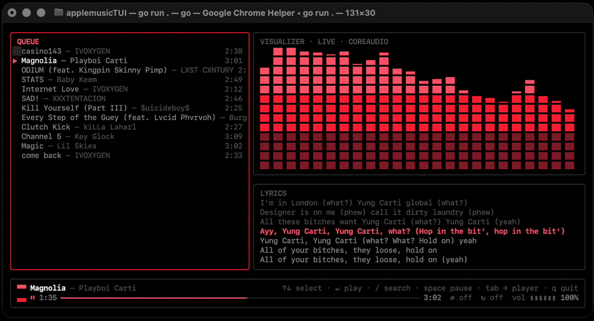
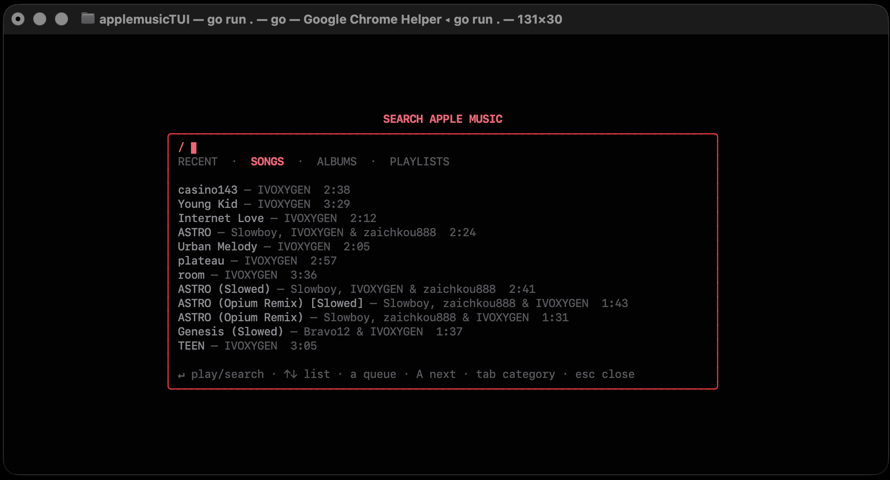
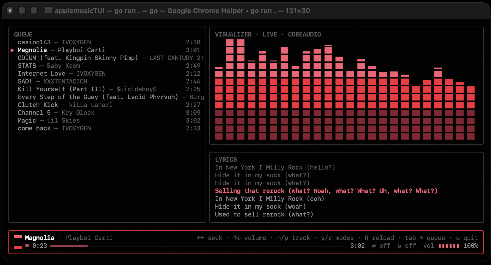

# applemusic-tui

**English** · [Русский](README.ru.md)


Apple Music in your terminal. `amtui` is a Bubble Tea TUI that drives the real
Apple Music web player inside a hidden Chromium — full catalog, real playback,
live audio visualizer, synced lyrics. No DRM hacks: the browser plays the audio
legally, amtui just gives it a terminal face.

<p align="center"></p>

## Features

- **Full Apple Music catalog** — search songs, albums and playlists, plus your
  recently played, straight from MusicKit.
- **Queue** — jump to any track, append to queue, play next.
- **Live visualizer** — a Winamp-style spectrum of what is actually playing:
  system-audio PCM through a 4096-sample Hann-window FFT into 32 bands
  (denser at low frequencies), 30 fps. CoreAudio process tap on macOS,
  PipeWire/PulseAudio monitor on Linux. Falls back to a clearly labeled
  simulated animation when live capture is unavailable.
- **Synced lyrics** — timestamped lines from [LRCLIB](https://lrclib.net),
  no API keys.
- **Transport** — play/pause, next/prev, seek, volume, shuffle, repeat.
- **Safe sign-in** — you log in inside a real browser window; your Apple ID
  credentials never touch the terminal.

## How it works

Apple Music has no public streaming API, and grabbing the stream would mean
breaking DRM — off the table. Instead, the browser plays the music legally and
amtui remote-controls it:

```
┌──────────────┐   chromedp (CDP)   ┌───────────────────────────┐
│  amtui (Go)  │ ◄────────────────► │ hidden Chromium           │
│  Bubble Tea  │                    │ music.apple.com, signed in│
└──────────────┘                    │ window.MusicKit (JS API)  │
                                    └───────────────────────────┘
```

One Go binary. It spawns a hidden Chromium with a persistent profile in
`~/.config/amtui/chrome` and talks to `window.MusicKit` in page context —
search, queue, play/pause, seek, now playing. No DOM scraping. Audio goes out
through the system mixer (the web player serves AAC 256; no lossless).

## Requirements

- An active **Apple Music subscription**
- **Go 1.26+** (to build from source)
- **Chrome or Chromium**
  - macOS: any recent Chrome/Chromium
  - Linux: a Widevine-capable browser — `google-chrome`, or Chromium with the
    Widevine plugin (e.g. `chromium-widevine` on the AUR)
- **macOS 14.2+** (the live visualizer uses a CoreAudio process tap),
  or **Linux** with `pipewire-pulse` (or plain PulseAudio) for live capture

> Linux support is **experimental** — designed for Arch/Ubuntu, currently less
> tested than macOS. On Hyprland the browser window is auto-hidden into a
> special workspace (Wayland forbids offscreen positioning); other Wayland
> compositors may leave the window visible for now.

## Install

```sh
git clone https://github.com/k1y0miiii/applemusic-tui
cd applemusic-tui
./install.sh
```

The script builds from source and installs `amtui` (plus `applemusic` and
`applemusic-tui` aliases) into `~/.local/bin`, adding it to PATH for
zsh / bash / fish. `--prefix DIR` installs elsewhere, `--no-path` leaves your
shell config alone. If Chrome is missing, the installer offers to install it
(Homebrew on macOS, the official `.deb` or AUR on Linux).

On macOS the live visualizer needs the Xcode Command Line Tools
(`xcode-select --install`) — the installer checks for them.

Prefer doing it by hand? `go build -o amtui .` works too; a `CGO_ENABLED=0`
build runs the visualizer in simulated mode instead of capturing real audio.

Run the test suite with `make test`, or `make verify` for the full check.

> Prebuilt binaries are planned. For now, the installer builds from source.

## First run

1. Launch `./amtui` — a **visible** browser window opens on music.apple.com.
2. Sign in with your Apple ID. It is a normal browser, so 2FA and captcha
   just work.
3. Done — the window hides and the TUI takes over. The session persists in
   `~/.config/amtui/chrome`, so next launches go straight to the player.


## Keys

### Player

| Key | Action |
| --- | --- |
| `Space` | Play / pause |
| `n` / `p` | Next / previous track |
| `Tab` | Switch focus: queue ⇄ transport |
| `j` `k` / `↓` `↑` | Queue: move selection · Transport: volume down / up |
| `Enter` | Play the selected queue track |
| `←` / `→` | Seek −5 s / +5 s (transport focused) |
| `s` | Toggle shuffle |
| `r` | Cycle repeat mode |
| `R` | Reload the web player if it wedges |
| `/` | Open search |
| `q` / `Ctrl+C` | Quit |

### Search

| Key | Action |
| --- | --- |
| typing | Edit the query |
| `Enter` | In input: search (empty query — your library) · In list: play selection |
| `Tab` | Next tab: RECENT / SONGS / ALBUMS / PLAYLISTS |
| `↓` `↑` / `j` `k` | Move through results (`↓` from the input dives into the list) |
| `a` / `A` | Add to the end of the queue / play next |
| `Esc` | Close search |

<p align="center"></p>
<p align="center"></p>

## Configuration

| Environment variable | Effect |
| --- | --- |
| `AMTUI_CHROME` | Path to the Chrome/Chromium binary (overrides auto-detection) |
| `AMTUI_DEBUG` | Run the browser visibly, with verbose logging |

## License

[MIT](LICENSE)
