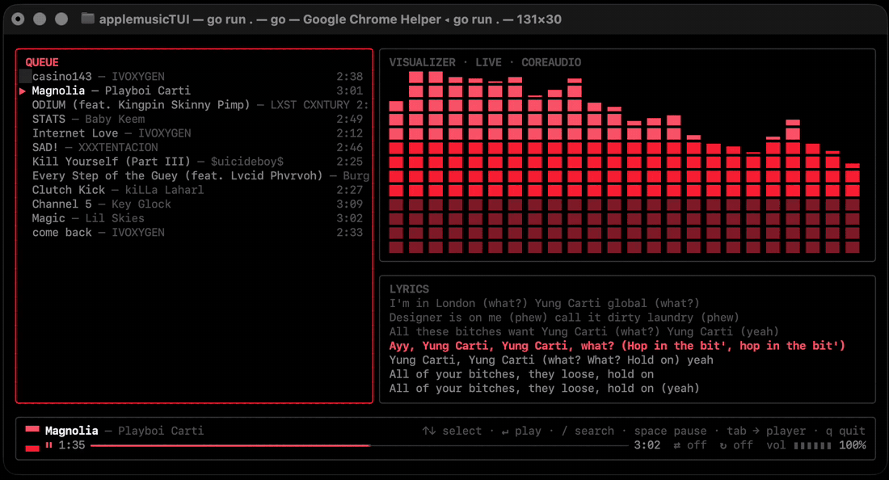
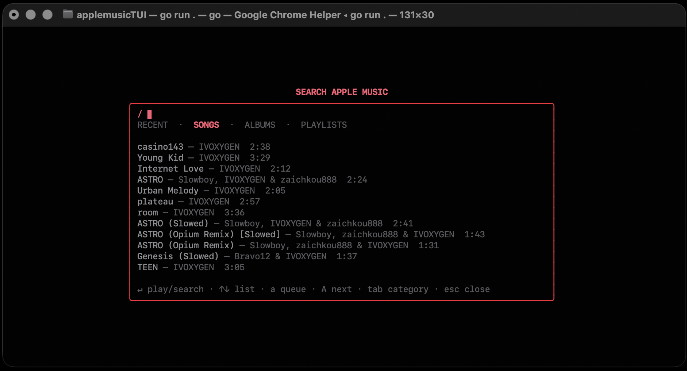
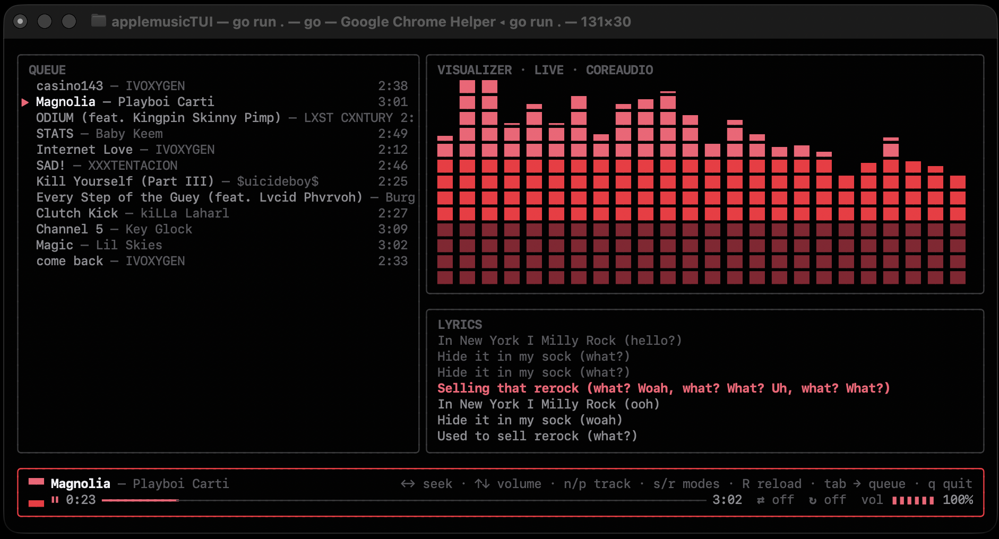

# applemusic-tui — Apple Music в терминале, на macOS **и** Linux

[English](README.md) · **Русский**


`amtui` — терминальный плеер Apple Music: полноценный TUI-клиент с поиском по
каталогу, живым спектральным визуализатором и синхронными текстами, работающий
**и на Linux, и на macOS**. Он управляет официальным веб-плеером Apple Music
внутри скрытого Chromium, поэтому воспроизведение — настоящее. Без взлома DRM:
браузер играет музыку легально, amtui лишь даёт ему терминальное лицо.

<p align="center"></p>

## Зачем amtui

Терминальные клиенты Apple Music обычно представляют собой AppleScript-пульты
к macOS-приложению Music.app: только под Mac и только для управления
программой, которая и так должна быть запущена. amtui вместо этого работает с
**веб**-плеером Apple Music через MusicKit — и это меняет набор возможностей:

- **Linux, а не только macOS.** Один и тот же Go-бинарник работает на обоих.
  (Поддержка Linux новее — см. примечание в разделе
  [Требования](#требования).)
- **Полный каталог прямо в терминале.** Поиск песен, альбомов и плейлистов
  напрямую через MusicKit, без десктопного приложения в цепочке.
- **Настоящий спектральный визуализатор.** Реальный PCM системного звука через
  FFT, а не декоративная анимация.
- **Синхронные тексты** из LRCLIB, рядом с ними — обложка альбома.
- **Учётные данные не попадают в терминал.** Вход происходит в настоящем окне
  браузера, поэтому 2FA и капча работают как обычно.

## Возможности

- **Полный каталог Apple Music** — поиск песен, альбомов и плейлистов, плюс
  недавно прослушанное, напрямую через MusicKit.
- **Очередь** — переход к любому треку, добавление в конец, «играть следующим».
- **Недавно прослушанное** — грид обложек под очередью: последние десять
  альбомов, плейлистов и синглов, набранные полублоками. Стрелки — выбор,
  `↵` — играть.
- **Живой визуализатор** — то, что реально играет: PCM системного звука через
  FFT с окном Ханна на 4096 сэмплов в 32 полосы (плотнее на низких частотах),
  30 fps. На macOS — CoreAudio process tap, на Linux — монитор
  PipeWire/PulseAudio. Если живой захват недоступен, включается честно
  подписанная симуляция. Три вида по клавише `v`: **столбики** в духе Winamp,
  вращающийся **тор**, у которого трубка гофрируется по спектру, и каркасная
  **сфера**, которая крутится медленно и пульсирует под бас.
- **Синхронные тексты** — строки с таймкодами из [LRCLIB](https://lrclib.net),
  без API-ключей, рядом — цветная обложка альбома полублоками.
- **Скробблинг в Last.fm** — по желанию, выключен, пока не настроите. Считает
  реально прослушанное, так что перемотка в конец трек не засчитает.
- **MPRIS на Linux** — медиа-клавиши, виджеты панели, экран блокировки и
  `playerctl` управляют плеером как любым десктопным. Появляется само, если
  есть сессионная шина.
- **Темы** — шесть встроенных палитр по клавише `t`, покомпонентное
  переопределение цветов в конфиге и режим `auto`, берущий акцент из обложки.
- **Транспорт** — пауза, следующий/предыдущий, перемотка, громкость,
  шаффл, повтор и прогресс-бар в виде формы волны уже сыгранного.
- **Безопасный вход** — логин происходит в настоящем окне браузера;
  учётные данные Apple ID не попадают в терминал.

## Как это работает

У Apple Music нет публичного API для стриминга, а вытаскивать поток — значит
ломать DRM, это исключено. Поэтому браузер играет музыку легально, а amtui
управляет им снаружи:

```
┌──────────────┐   chromedp (CDP)   ┌───────────────────────────┐
│  amtui (Go)  │ ◄────────────────► │ скрытый Chromium          │
│  Bubble Tea  │                    │ music.apple.com, залогинен│
└──────────────┘                    │ window.MusicKit (JS API)  │
                                    └───────────────────────────┘
```

Один бинарник на Go. Он запускает скрытый Chromium с постоянным профилем в
`~/.config/amtui/chrome` и общается с `window.MusicKit` в контексте страницы:
поиск, очередь, пауза, перемотка, «сейчас играет». Никакого скрейпинга DOM.
Звук выходит через системный микшер (веб-плеер отдаёт AAC 256, без lossless).

## Требования

- Активная **подписка Apple Music**
- **Go 1.26+** (для сборки из исходников)
- **Chrome или Chromium**
  - macOS: любой свежий Chrome/Chromium
  - Linux: браузер с Widevine — `google-chrome` или Chromium с плагином
    Widevine (например, `chromium-widevine` из AUR)
- **macOS 14.2+** (живой визуализатор использует CoreAudio process tap)
  или **Linux** с `pipewire-pulse` (или обычным PulseAudio) для живого захвата

> Поддержка Linux — **экспериментальная**: рассчитана на Arch/Ubuntu,
> пока проверена меньше, чем macOS. На Hyprland окно браузера автоматически
> прячется в special workspace (Wayland запрещает уводить окна за экран);
> на других Wayland-композиторах окно пока может оставаться видимым.

> Windows-бинарники **не протестированы и неполны**: они собираются и плеер
> работает, но бэкенда захвата системного звука под Windows нет, поэтому
> визуализатор всегда идёт в честно подписанном режиме симуляции. Нужен
> Windows Terminal — старая консоль рисует TUI некорректно. Отчёты приветствуются.

## Установка

### Готовые бинарники

Возьмите архив под свою платформу в
[последнем релизе](https://github.com/k1y0miiii/applemusic-tui/releases/latest) —
macOS (Apple Silicon / Intel), Linux (x86-64 / arm64) и Windows
(x86-64 / arm64):

```sh
tar -xzf amtui-*-linux-amd64.tar.gz
sudo install -m755 amtui-*/amtui /usr/local/bin/amtui
amtui --version
```

В каждом релизе есть файл `SHA256SUMS`, проверка —
`shasum -a 256 -c SHA256SUMS`.

Бинарники под macOS не подписаны, поэтому перед первым запуском нужно
`xattr -d com.apple.quarantine amtui` (или правый клик → «Открыть»).

### Из исходников

```sh
git clone https://github.com/k1y0miiii/applemusic-tui
cd applemusic-tui
./install.sh
```

Скрипт собирает проект из исходников и ставит `amtui` (плюс алиасы
`applemusic` и `applemusic-tui`) в `~/.local/bin`, прописывая PATH для
zsh / bash / fish. `--prefix DIR` — установить в другой каталог,
`--no-path` — не трогать конфиг шелла. Если Chrome не найден, установщик
предложит поставить его сам (Homebrew на macOS, официальный `.deb` или AUR
на Linux).

На macOS живому визуализатору нужны Xcode Command Line Tools
(`xcode-select --install`) — установщик сам это проверит.

Руками тоже можно: `go build -o amtui .`; сборка с `CGO_ENABLED=0` работает,
визуализатор тогда крутится в режиме симуляции вместо захвата реального
звука.

Тесты — `make test`, полная проверка — `make verify`.

> Собрать все релизные архивы самому: `make dist`. Полный набор получается
> только на macOS — darwin-сборкам нужен cgo для CoreAudio-визуализатора, а
> цели Linux и Windows на чистом Go и кросс-компилируются откуда угодно.

## Первый запуск

1. Запустите `./amtui` — откроется **видимое** окно браузера на
   music.apple.com.
2. Войдите со своим Apple ID. Это обычный браузер, так что 2FA и капча
   работают как всегда.
3. Готово — окно прячется, управление берёт TUI. Сессия хранится в
   `~/.config/amtui/chrome`, следующие запуски идут сразу в плеер.


## Клавиши

### Плеер

| Клавиша | Действие |
| --- | --- |
| `Space` | Пауза / воспроизведение |
| `n` / `p` | Следующий / предыдущий трек |
| `Tab` | Фокус по кругу: очередь → недавно прослушанное → транспорт |
| `j` `k` / `↓` `↑` | Очередь: выбор трека · Недавнее: ряд грида · Транспорт: громкость тише / громче |
| `Enter` | Играть выбранный трек очереди или обложку из недавнего |
| `←` / `→` | Недавнее: предыдущая / следующая обложка · Транспорт: перемотка −5 с / +5 с |
| `s` | Шаффл |
| `r` | Режим повтора (по кругу) |
| `?` | Показать все клавиши |
| `v` | Переключить визуализатор: столбики → тор → сфера |
| `t` | Переключить цветовую тему |
| `R` | Перезагрузить веб-плеер, если завис |
| `/` | Открыть поиск |
| `q` / `Ctrl+C` | Выход |

### Мышь

Клик по строке очереди или по обложке — играть, клик по полосе прогресса —
перемотка, колесо над очередью или сеткой обложек двигает выбор.

### Поиск

| Клавиша | Действие |
| --- | --- |
| ввод текста | Редактировать запрос |
| `Enter` | В поле ввода: искать (пустой запрос — ваша библиотека) · В списке: играть выбранное |
| `Tab` | Следующая вкладка: RECENT / SONGS / ALBUMS / PLAYLISTS |
| `↓` `↑` / `j` `k` | Навигация по результатам (`↓` из поля ввода ныряет в список) |
| `a` / `A` | Добавить в конец очереди / играть следующим |
| `Esc` | Закрыть поиск |

<p align="center"></p>
<p align="center"></p>

## Визуализатор

Клавиша `v` переключает три формы по кругу; выбор сохраняется в
`~/.config/amtui/vizmode`.

| Режим | Что рисует |
| --- | --- |
| `bars` | Спектр из 32 полос с маркерами пиков. По умолчанию. |
| `torus` | Вращающийся бублик. Толщина трубки в каждой точке кольца берётся из полосы, которой принадлежит этот угол, — форма гофрируется по спектру. |
| `sphere` | Каркасный глобус из широт и меридианов с затенением по глубине. Частота ложится на широту симметрично, поэтому бас раздувает талию. |

На бит объёмные формы отвечают по-разному. Тор отвечает движением: бас-удар
ускоряет вращение. Сфера отвечает размером — крутится она примерно втрое
медленнее, зато раздувается и сжимается на удар, так что смотришь на пульс,
а не на вращение.

Обе читают бит как превышение низа над его же скользящим средним, а не как
громкость. Полосы нормализованы по окну в 63 дБ, поэтому кик на 6 дБ громче
сустейна сдвигает абсолютное значение всего на десятую, а за трек низ держится
высоко и почти ровно — от него фигура просто стоит на месте.

Столбики не делают ни того, ни другого — они и есть спектр. Независимо от
режима рамки панелей пульсируют по басу; выключается ключом `visualizer.pulse`.

Обе объёмные формы — обычный ASCII поверх тех же 32 полос, что и у столбиков:
лишней работы со звуком нет, цвета берутся из активной темы.

## MPRIS (Linux)

amtui публикует себя в D-Bus как `org.mpris.MediaPlayer2.amtui`, поэтому
рабочий стол управляет им, даже когда терминал не в фокусе:

```sh
playerctl -p amtui play-pause
playerctl -p amtui metadata
```

Медиа-клавиши, апплеты панели и экран блокировки подхватывают его сами.
Подключены пауза, следующий/предыдущий, перемотка и громкость; списка треков
и окна для «поднять» нет, и это честно объявлено. Появляется при наличии
сессионной шины и тихо пропускается, если её нет — в TTY, в контейнере или на
macOS.

## Last.fm

Скробблинг включается вручную. Заведите API-аккаунт на
[last.fm/api/account/create](https://www.last.fm/api/account/create), впишите
ключ и секрет в секцию `[lastfm]` в `~/.config/amtui/config.toml` и один раз
выполните:

```sh
amtui lastfm-auth
```

Команда напечатает ссылку для подтверждения и сохранит ключ сессии в
`~/.config/amtui/lastfm` (права 600) — в конфиге его держать не нужно. Пока
нет всех трёх частей, никуда ничего не отправляется.

Трек засчитывается после половины длительности или четырёх минут — что раньше,
и никогда короче 30 секунд: это правила самого Last.fm. Время считается по
реально прослушанному, а не по позиции воспроизведения, поэтому перетаскивание
полосы в конец прослушиванием не считается.

## Темы

Шесть встроенных тем: `apple` (по умолчанию), `catppuccin`, `gruvbox`, `nord`,
`mono` и `auto`. Клавиша `t` переключает их по кругу; выбор сохраняется в
`~/.config/amtui/theme`.

`auto` берёт акцентный цвет из доминирующего цвета обложки текущего трека.
Меняется только акцент — фон и текст остаются нейтральными, поэтому никакая
обложка не сделает интерфейс нечитаемым.

Чтобы задать тему заранее или переопределить отдельные цвета, скопируйте
[`docs/config.example.toml`](docs/config.example.toml) в
`~/.config/amtui/config.toml`. Тот же файл включает и выключает пик-маркеры,
пульс по басу, волновой прогресс-бар и обложку.

## Настройка

| Переменная окружения | Эффект |
| --- | --- |
| `AMTUI_CHROME` | Путь к бинарнику Chrome/Chromium (вместо автоопределения) |
| `AMTUI_CONFIG_DIR` | Каталог конфигурации (по умолчанию `~/.config/amtui`) |
| `AMTUI_DEBUG` | Запустить браузер видимым, с подробными логами |

## Лицензия

[MIT](LICENSE)
